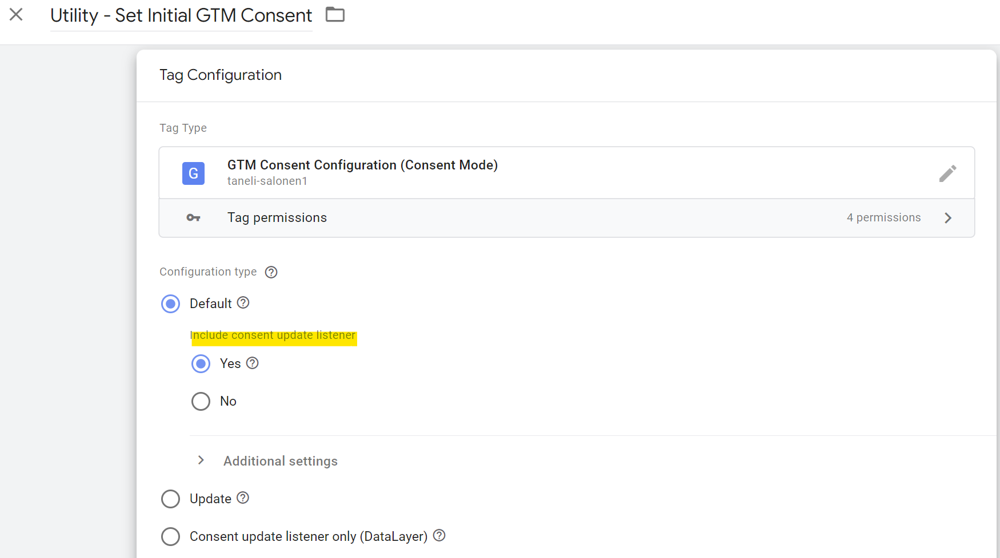

# GTM Consent Configuration

This tag template is used to set and update the consent types in GTM. Once set, the consent settings can be used in GTM to allow/block tags from executing or to implement **Google Consent Mode** or **Microsoft Consent Mode**.

## Included consent types

The tag templates supports the default Consent Mode parameters as well as other "privacy parameters" available in the consent API.

https://support.google.com/tagmanager/answer/10718549#consent-types

## Consent change listener

The can also be used to listen for changes in the consent preferences. The listener sends a dataLayer event for each consent type once their status changes from denied to granted.

Example dataLayer push:

```
{
    "event": "analytics_storage_granted",
    "container_id": "GTM-ABCDEFG"
}
```
The container_id parameter can be used for event deduplication in case multiple consent listeners have been added by multiple GTM containers installed on the same page.

### Set up the consent change listener

There are two options for setting up the consent change listener:
1. Via the consent "default" setting
2. Separately without setting consent types during the same execution

Option 1 is the easiest, when the template is also used for setting the Consent Mode consent types.



Option 2 can be useful, for example, if the CMP itself sets the consent types. In this case, the additional listeners can be useful for detecting when the consents become granted and the tags can be fired for the first time.


With option 2, make sure to set the listeners immediately after the consent types have been set. For example, set the consent types using the Consent Initialization trigger and add the listeners using the Initialization trigger.

## Microsoft UET Consent Mode

The tag now also supports Microsoft Consent Modes, which relies on a similar logic with the default consent and update consent commands. Microsoft Consent Mode can be enabled with one click in the tag settings.


## Implementation example with OneTrust

This blog post goes through how you can use the tag template for integrating OneTrust with GTM's consent configuration and Google Consent Mode: https://tanelytics.com/integrate-onetrust-with-google-tag-manager/